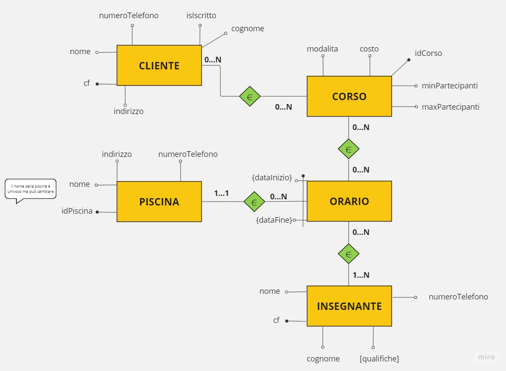

# Esercitazione su schemi ER - Le piscine
Si vuole progettare una base di dati contenente le informazioni relative alle piscine gestite dal comune di Udine.
-------------------------------------
Entità che utilizzeremo:
- Piscina --> nome, indirizzo, numeroTelefono, _idPiscina_;
- Corso --> modalita, costo, minPartecipanti, maxPartecipanti, _idCorso_;
- Insegnante --> _cf_, nome, cognome, numeroTelefono, [qualifiche]; 
- Cliente --> isIscritto, _cf_, nome, cognome, indirizzo, numeroTelefono;
- Orario --> _dataInizio_, _dataFine_, _idPiscina_; 
-------------------------------------
Schema ER (entity relationship):

